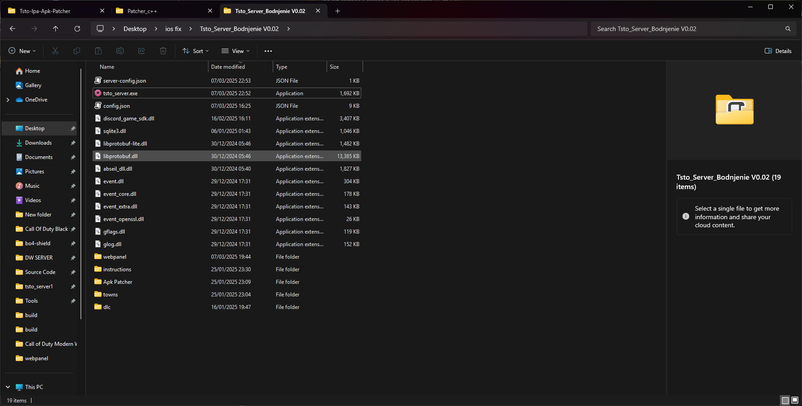

# How To Setup

## Setting up the server.

After you extracted the zip you are left with.

<figure><figcaption></figcaption></figure>

Simply open tsto\_server.exe

<figure><figcaption></figcaption></figure>

This window will open that means server is running.
