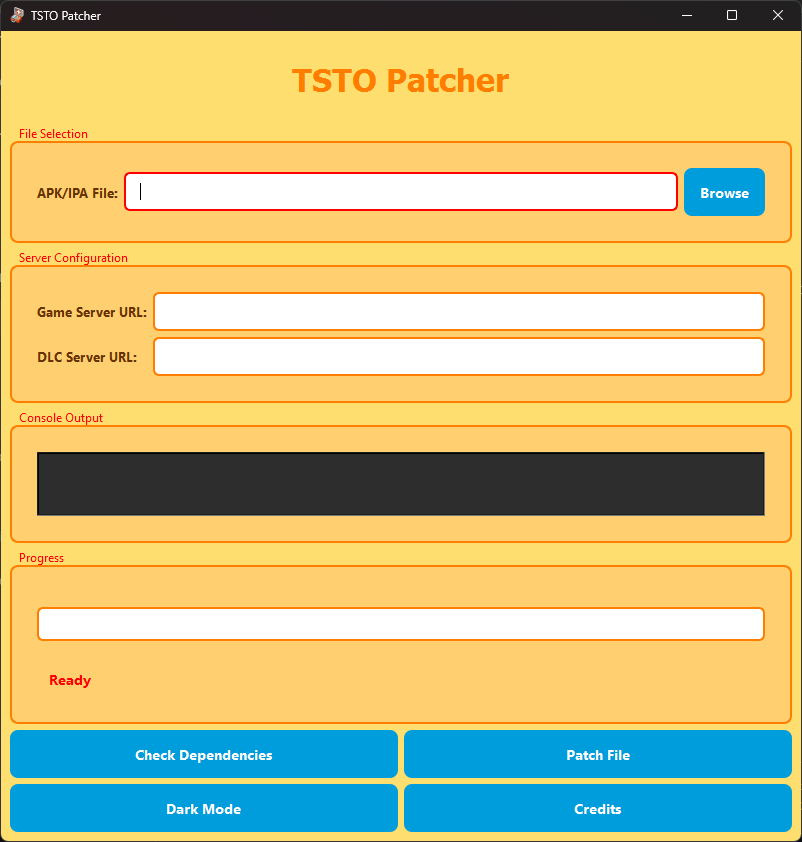

# Patch Ipa&#x20;

## Patching Ipa files.

<figure><figcaption></figcaption></figure>

1. Select Browse then Open Unpatched Folder. Select tsto.ipa
2. Enter server ip and dlc .
3. Press Patch.

* **Server IP:** Enter the server IP in the format: `http://[ip_here]:80`.
* **DLC IP:** Enter the DLC IP in the format: `http://[ip_here]:80`.

## &#x20;IP Address Example

* **Server IP:** `http://192.168.1.1:80`
* **DLC IP:** `http://192.168.1.2:80`
